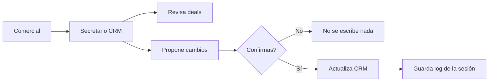
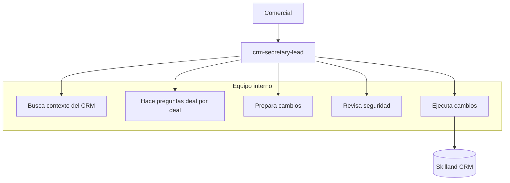
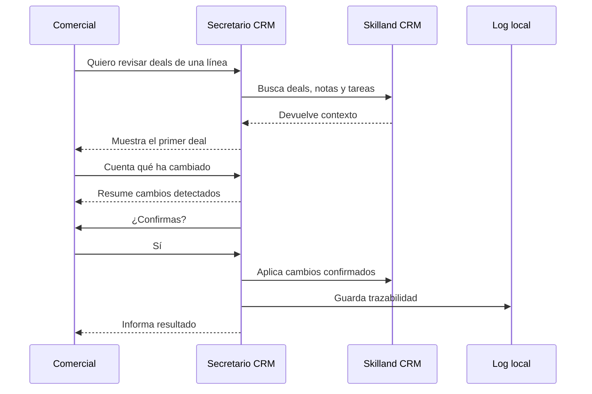
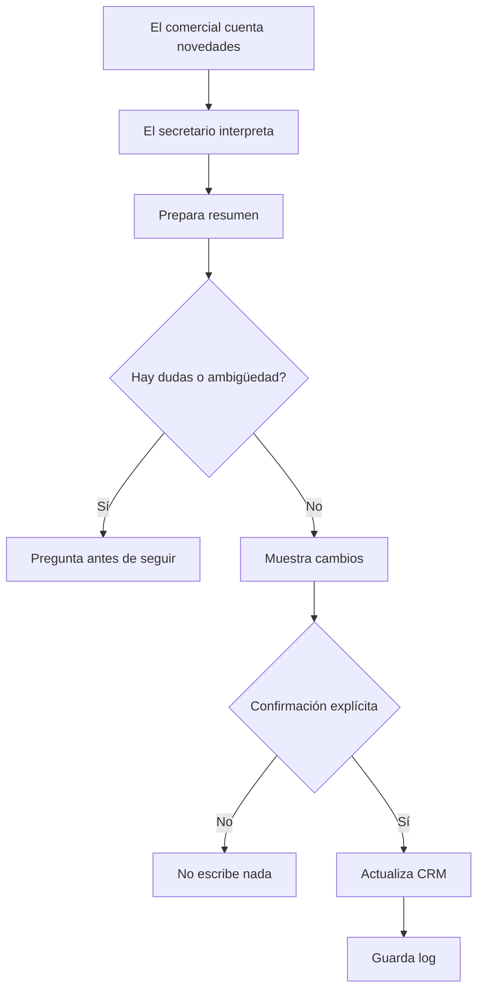
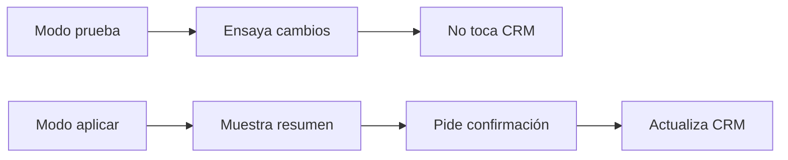
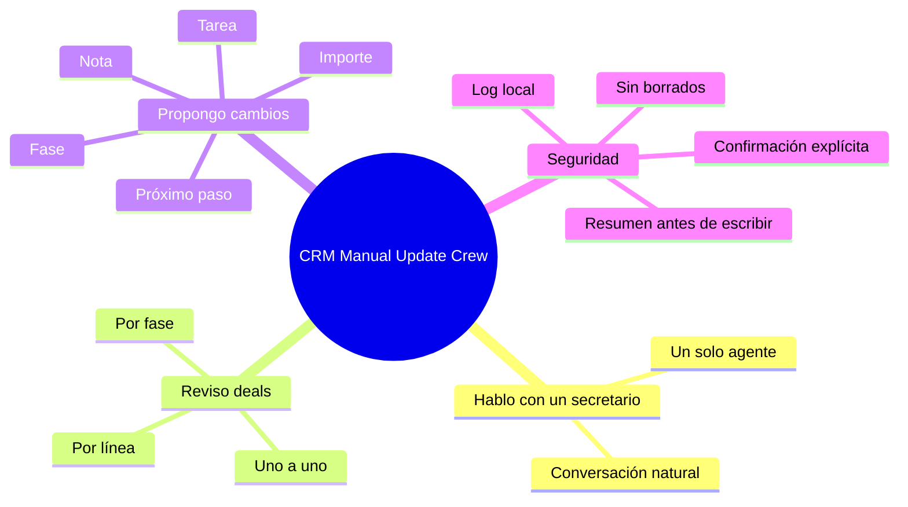

# CRM Manual Update Crew

Guía sencilla para comerciales de Skilland

## Idea principal

El CRM Manual Update Crew es como tener un secretario del CRM sentado contigo.

Tú no tienes que actualizar deal por deal desde la interfaz. Solo hablas con un
asistente, le cuentas qué ha cambiado, él prepara los cambios, te enseña el
resumen y solo actualiza el CRM si tú confirmas.



## Con quién hablas

Solo hablas con un agente:

```text
crm-secretary-lead
```

Ese agente es tu punto de entrada. Tú no tienes que saber qué subagentes existen
ni cómo funciona por dentro.



Para ti la experiencia es simple:

> "Quiero revisar estos deals. Este ha avanzado. Este se queda igual. Este tiene
> una tarea pendiente. Este pasa a propuesta. Confirma."

## Cómo se usa

La forma normal de usarlo es pedir una revisión:

```text
Revisa los deals de Skilland MicroCred.
```

También puedes pedir algo más concreto:

```text
Revisa los deals en fase Propuesta.
```

```text
Revisa los deals abiertos sin actualización reciente.
```

```text
Vamos a revisar los deals de UPCT.
```

El secretario te irá guiando.

## Qué ocurre en una sesión



## Qué te muestra de cada deal

Por cada deal verás un resumen como este:

```text
DEAL 3/12 - UPCT - Piloto Microcredenciales

Stage actual: Propuesta en preparación
Importe: sin definir
Empresa: UPCT
Contacto: Josefa García León
Business Line: Skilland MicroCred
Última actualización: 2026-06-08

Últimas notas:
- Se comprometió envío de dossier...

Tareas abiertas:
- Enviar dossier UPCT
- Revisar decisión tras reunión interna
```

Después te preguntará:

```text
¿Qué ha cambiado con este deal?
```

## Cómo responder

Puedes responder de forma natural:

```text
Se envió el dossier. Josefa lo revisa con vicerrectorado.
Mover a propuesta presentada. Crear tarea de seguimiento para el miércoles.
```

O puedes usar comandos rápidos:

```text
nota: Se envió el dossier y queda pendiente revisión interna.
```

```text
mover a propuesta presentada
```

```text
importe 16000
```

```text
crear tarea llamar a Josefa el viernes
```

```text
cerrar tarea enviar dossier
```

```text
siguiente paso: enviar propuesta revisada
```

```text
skip
```

## Chuleta de comandos

| Comando | Para qué sirve |
|---|---|
| `skip` | Saltar el deal sin cambios |
| `nota: ...` | Añadir una nota al deal |
| `mover a ...` | Cambiar la fase del deal |
| `importe 16000` | Actualizar el importe |
| `crear tarea ...` | Crear una tarea relacionada |
| `cerrar tarea ...` | Marcar una tarea existente como cerrada |
| `siguiente paso: ...` | Registrar el próximo paso |
| `resumen` | Ver cambios pendientes antes de confirmar |
| `confirmar` | Confirmar cambios propuestos |
| `cancelar` | Parar la sesión |

## Seguridad

La herramienta está pensada para evitar errores.



Reglas importantes:

- No escribe nada sin confirmación.
- No borra información.
- No inventa datos.
- Si no sabe qué contacto, empresa, tarea o fase quieres, pregunta.
- Si una tarea coincide con varias, te pide elegir.
- Si estás en modo prueba, no toca el CRM.

## Modo prueba y modo aplicar

Hay dos formas de trabajar:



### Modo prueba

Sirve para practicar o revisar qué haría la herramienta.

```bash
yarn crm:review
```

En este modo no se escribe nada.

### Modo aplicar

Sirve para actualizar CRM de verdad.

```bash
yarn crm:review --apply
```

Aunque uses este modo, el secretario seguirá pidiendo confirmación antes de
escribir cada grupo de cambios.

## Ejemplo completo

```text
Secretario:
DEAL 3/12 - UPCT - Piloto Microcredenciales
Stage actual: Propuesta en preparación
Importe: sin definir
Tareas abiertas:
- Enviar dossier UPCT
- Revisar decisión tras reunión interna

¿Qué ha cambiado con este deal?

Comercial:
Se envió el dossier. Josefa lo revisa con vicerrectorado.
Mover a propuesta presentada. Crear tarea seguimiento con Josefa el miércoles.
Cerrar tarea enviar dossier.

Secretario:
Cambios detectados:
- Mover deal a Propuesta presentada
- Crear nota con el resumen indicado
- Crear tarea Seguimiento con Josefa para el miércoles
- Cerrar tarea Enviar dossier UPCT

¿Confirmas estos cambios? [y/N]

Comercial:
y

Secretario:
Cambios aplicados. Log guardado.
```

## Qué puede hacer ahora

- Revisar deals por Business Line.
- Revisar deals por fase.
- Mostrar contexto importante de cada deal.
- Añadir notas.
- Crear tareas.
- Cerrar tareas.
- Cambiar fase.
- Cambiar importe.
- Registrar próximo paso.
- Saltar deals sin cambios.
- Guardar log de sesión.

## Qué no hace todavía

- No lee WhatsApp automáticamente.
- No lee email automáticamente para decidir cambios.
- No manda emails.
- No crea dashboards.
- No sustituye el criterio comercial.
- No actualiza nada sin confirmación humana.

## Buenas prácticas

Cuando revises deals, intenta decir siempre:

- qué ha pasado desde la última actualización
- si el deal sigue vivo
- si cambia de fase
- si cambia el importe
- cuál es el próximo paso
- si hay una tarea nueva
- si hay una tarea antigua que cerrar

Ejemplo recomendado:

```text
Sigue vivo. Se envió propuesta revisada. El cliente la revisa esta semana.
Mover a propuesta presentada. Importe 16000. Crear tarea seguimiento el viernes.
Cerrar tarea preparar propuesta.
```

## Dónde queda la trazabilidad

Cada sesión deja un log local.

```text
04_outputs/crm_manual_update_crew/logs/
```

Ese log sirve para revisar:

- qué deals se revisaron
- qué cambios se propusieron
- qué cambios se confirmaron
- qué se escribió en CRM
- si hubo algún error

## Resumen mental



La idea es simple: tú llevas el criterio comercial; el secretario se encarga de
mantener el CRM ordenado.

